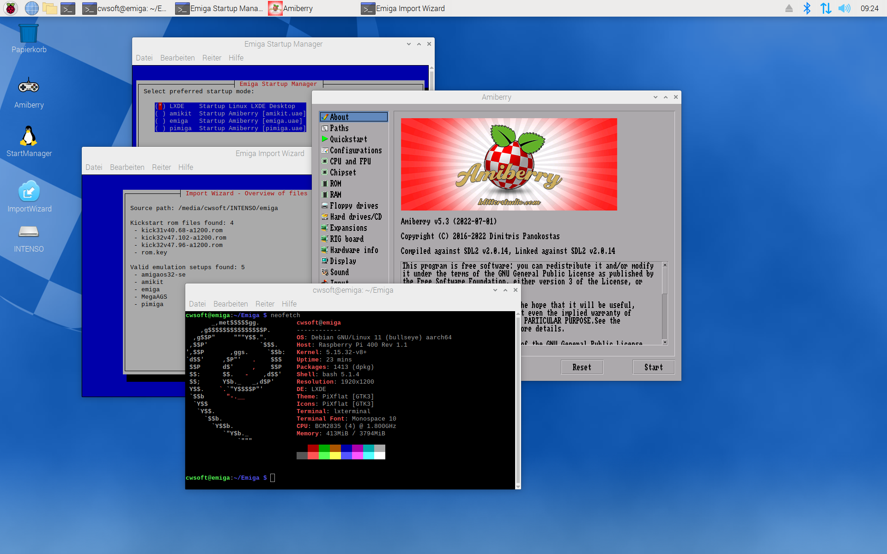
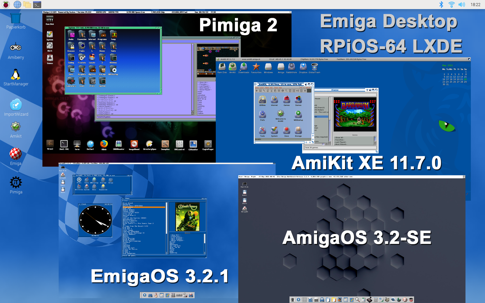

# Emiga - Emulated Amiga for Pi4/400
This repo allows you to create an emulated Amiga environment (Emiga) on your Pi 4/400 on top of a clean [RPiOS-64 LXDE Desktop](https://www.raspberrypi.com/software/operating-systems/#raspberry-pi-os-64-bit) installation. The setup installs the required apt packages, [Amiberry v5.2 (SDL2)](https://github.com/midwan/amiberry), sets-up a Samba server for easier data exchange (`\\emiga` on Windows) and adds some desktop icons and a Amiga wallpaper to your RPiOS-64 LXDE Desktop.



**Please note:** To stay legal, no files under active copyright are contained in the default Emiga setup. It's up to you to setup your own Amiga Workbench or to port over any of your existing [AmiKit](https://www.amikit.amiga.sk) or [Pimiga](https://youtube.com/watch?v=KLJk8fTjQLw) setups to Emiga. The required steps are shown in
**Section D**.

## A: Prerequisites
- Pi4/400 with a fast SD-card (at least 32 GB, for porting Pimiga2 use 64 GB)
- Preinstalled [Raspberry Pi OS LXDE Desktop](https://www.raspberrypi.com/software/operating-systems/#raspberry-pi-os-64-bit) (64-bit, Debian Bullseye)

## B: Setup RPiOS-64 LXDE Desktop
1. Download latest official [RPiOS-64 LXDE Desktop image](https://www.raspberrypi.com/software/operating-systems/#raspberry-pi-os-64-bit)
2. Compare SHA256 hash before flashing the image on your SD card
3. Flash image on an empty SD card using e.g. [Raspberry Pi Imager](https://www.raspberrypi.com/software/) or [balenaEtcher](https://www.balena.io/etcher/)
4. Boot your Pi from the flashed SD card
5. Follow initial RPiOS-64 desktop setup:
   - Set country, language and timezone
   - Create a new user account (no space in name)
   - Setup WiFi (choose network, enter credentials)
   - Download system updates
   - Reboot your Pi

## C: Setup Emiga on your Pi4/400
Open a terminal and execute the following commands. Reboot your Pi afterwards to apply any pending Emiga settings.
```
cd
git clone https://github.com/cwsoft/Emiga.git
./Emiga/scripts/setup/emiga_setup.sh
```
## D: Customize your Emiga Setup
After the initial Emiga setup, you will find three icons on your Linux Desktop:
- **Amiberry**: Open [Amiberry v5.2 (SDL2)](https://github.com/midwan/amiberry) GUI to create/modify your Amiga setups
- **StartManager**: Define setup started after boot-up (Default: LXDE Linux Desktop)
- **ImportWizard**: Import custom ROMs and setups from USB (e.g. Workbench 3.x, AmiKit, Pimiga)

The collage below shows my customized Emiga setup including my own EmigaOS 3.2.1 Workbench setup, a ported versions of my purchased [AmiKitXE](https://www.amikit.amiga.sk) setup and a light version of [Pimiga2](https://youtube.com/watch?v=KLJk8fTjQLw) without Musics and Demos on a single 32 GB SD card.



Sections below explain how to setup your own Workbench or port an existing [AmiKit](https://www.amikit.amiga.sk) or [Pimiga](https://youtube.com/watch?v=KLJk8fTjQLw) setup over to Emiga.

### D1: Create your own Workbench Setup
To start off, some legal Amiga kickstart roms and workbench files are needed. [Amiga Forever](https://www.amigaforever.com) from Cloanto or [AmigaOS 3.2.x](https://www.hyperion-entertainment.com) from Hyperion contain all files needed to setup your own customized Amiga Workbench with all your favorite tools and games you enjoyed 30 years ago. It's assumed you know how to setup a Workbench. If your knowledge is a bit rusty, you can check out some [Youtube guides](https://www.youtube.com/watch?v=jJG8-KG9tLI) first.

**Steps to create your own Workbench Setup:**
1. Open Amiberry by clicking the *Amiberry* icon
2. [Create your Workbench setup](https://www.youtube.com/watch?v=XKnSbTQDI_o). Store the Amiberry config file in `$HOME/Emiga/public/configs/your_setup.uae`. All folders, files and games of your setup are stored in the folder `$HOME/Emiga/emulations/your_setup/`.
3. Copy `$HOME/Emiga/templates/desktop/emulation.desktop.tpl` to `$HOME/Desktop/your_setup.desktop`
4. *Optional:* Copy a PNG desktop icon for your setup to `$HOME/Emiga/assets/icons/your_setup.png`
5. Adapt `{PLACEHOLDERS}` for name, descriptions and pathes in `your_setup.desktop` to your needs
```
[Desktop Entry]
Name={EMULATION_NAME} -> e.g. AmiKit
Comment=Start {EMULATION_NAME} 
GenericName=Started {EMULATION_NAME}

Type=Application
StartupNotify=false
Terminal=false
Exec={HOME}/Emiga/scripts/amiberry.sh {EMULATION_UAE} -> e.g. amikit.uae
Path={HOME}/Emiga/amiberry -> e.g. /home/USER
Icon={HOME}/Emiga/assets/icons/{EMULATION_PNG} -> e.g. amikit.png
```
6. Click *StartManager* to select preferred start mode (LXDE Desktop or any custom Amiberry .uae config).
7. Click *Desktop icon* of your setup added in Step 4 to start your setup

**Please note:** When starting a new or ported Amiga setup the very first time, the screen mode needs to be adapted for a nice user experience. In Pimiga2, the screen mode can be set via `System:Prefs/ScreenMode`. All Workbench setups include the `ScreenMode` tool to set a proper resultion like 32-bit 1920x1080 px.

### D2: Porting Pimiga2 to Emiga
**Note:** It's assumed you already have [Pimiga2](https://youtube.com/watch?v=KLJk8fTjQLw) up and running on your Pi4/400 incl. a stable internet connection.

1. Format a fast 64-GB USB 3.2 stick with `exFat` file format on your computer (e.g. Windows)
2. Plug formated USB stick into your Pi, then boot-up your Pimiga2 setup from SD-Card
3. Quit out of Pimiga Scalos Workbench via `(F12 -> Quit)`
4. Ensure formated USB stick was mounted correctly during boot-up. Enter `ls /media` and check for the mount-points: `usb` and `kick`.
5. Then enter following commands to copy Pimiga2 to your USB stick:
   ```
   # Install zip command (requires LAN/WLAN internet connection)
   sudo apt install zip
   
   # Create Emiga folder structure on USB drive and copy over kickstart roms and config files
   sudo mkdir -p /media/usb/emiga/kickstarts /media/usb/emiga/emulations/pimiga
   sudo cp /media/kick/*.* /media/usb/emiga/kickstarts
   sudo cp ~/amiberry/conf/Pimiga.uae /media/usb/emiga/emulations/pimiga/pimiga.uae
   sudo sed -i "s#/media/kick/#{HOME}/Emiga/public/kickstarts/#" /media/usb/emiga/emulations/pimiga/pimiga.uae
   sudo sed -i "s#/home/pi/#{HOME}/Emiga/emulations/#" /media/usb/emiga/emulations/pimiga/pimiga.uae
   
   # Create pimiga.zip archive with all folders and files from ~/pimiga (~ 35 GB)
   # My Pimiga-Light setup (~ 11 GB) consists of pimiga/disks/[System/|Work/|Games/] with adjusted System/S/user-startup
   # Note: Ziping 35 GB can easily take 2 hours or more so go out for a walk
   cd
   sudo zip -r /media/usb/emiga/emulations/pimiga/pimiga.zip pimiga/*
   ```
6. Shutdown your Pi via `sudo shutdown now`, eject Pimiga SD-Card and plug in Emiga SD-Card, then reboot
7. Copy a nice PNG icon (e.g. PI-symbol) to the USB stick: `emiga/emulations/pimiga/pimiga.png`
8. Run Emigas `ImportWizard` and import Pimiga2 from the prepared USB stick
9. Click the desktop icon from Step 7 and adjust screen mode on first start via `System:Prefs\ScreenMode`

### D3: Setup USB Stick for the ImportWizard
As outlined in **Section D2**, porting over any existing Amiga setup to Emiga is just a matter of copying some folders and files to an empty USB stick and to adapt some pathes in the WinUAE/Amiberry configuration files. The Emiga *ImportWizard* expects a certain file structure on your USB stick in order to recognize your setup as outlined below:
```
emiga/
  kickstarts/
    your_legal_kickstart.rom (basename.ext)
    another_legal_kickstart.rom (basename.ext)
    rom.key (basename.ext)
    ...
  emulations/
    setup1/ (folder name is up to you)
      setup1.zip (REQUIRED: Zip file must match folder name)
      setup1.uae (REQUIRED: Config file must match folder name)
      setup1.png (OPTIONAL: Creates a desktop icon. Image file must match folder name)
    setup2/ (another custum setup)
      setup2.zip (REQUIRED: Zip file must match folder name)
      setup2.uae (REQUIRED: Config file must match folder name)
      setup2.png (OPTIONAL: Creates a desktop icon. Image file must match folder name)
    ...
```

**Note:** The `setup.zip` includes all required files (e.g. harddisks, harddrives, folders, files, apps, games) of your custom Amiga emulation setup. The `setup.uae` file provides the WinUAE/Amiberry configuration of your setup (e.g. Amiga Model, Hardware, Kickstarts, Harddrives). If you want to share your setup with others, you can use placeholder `{HOME}` in your `setup.uae`, which resolves to the users `$HOME` path during import process.

The `import_wizard.sh` scans the mounted USB drives in `/media/USER` for `emiga/kickstarts` and `emiga/emulations` folders. Any valid emulation must contain a `setup.zip` and `setup.uae` file and stick to the naming conventions above. If you add a `setup.png` file, a desktop icon named `Setup` will be created for you. Ensure your SD card has enough space left to copy/unzip your setups, as disk space isn't checked upfront.

## E: License
The bash setup scripts and templates are released under [GNU General Public License](./LICENSE.txt) (Version 3). If you base your work upon Emiga, please respect the chosen license for your customized version as well.

## F: Contribution
Any help or input is highly appreciated. If you would like to contribute to this project, just contact me via Github or send me a pull request to review and include your code proposals.

Have fun
cwsoft
